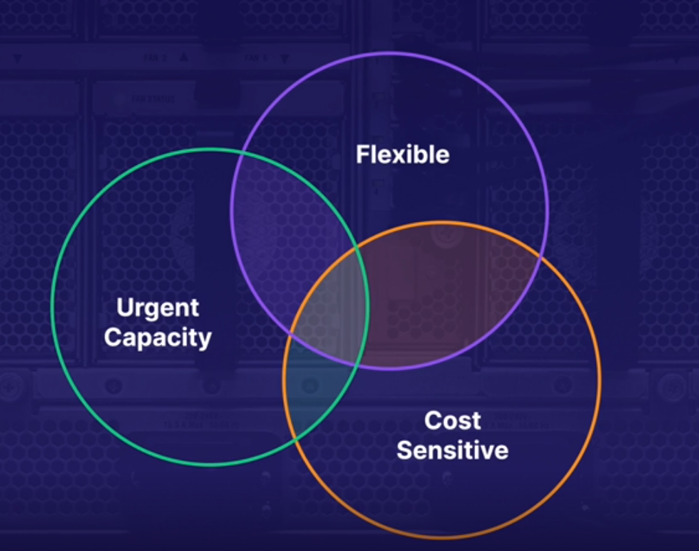

# Elastic Compute Cloud (EC2)

Secure resizable compute capacity in the cloud

Like a VM only hosted in AWS instead of your own data center

Providing you the capacity you want when needed, giving you full control of the server

## Brief History

Launched in 2006 and was complete game changer basically over night.

Pay only for what you use, and provides us a way to have NO wasted capacity

### On Premises Infrastructure

3-5 year contracts

10-20 business days average to get server online

large upfront capital expense

## Pricing Options

- On Demand
  - Pay by the hour or second
- Reserved
  - Reserved capacity for up to 1 - 3 years
  - Up to 72% discount on the hourly charge
- Spot
  - Purchase unused capacity at discount of up to 90%
  - Prices fluctuate with demand
- Dedicated
  - Most expensive
  - Physical EC2 servers dedicated for your needs

### On Demand

Would be used when you need:

- Flexibility of Amazon Ec2 without upfront payment or long-term commitment
- Short term applications with spiky or unpredictable workloads
- Testing the water with applications being developed or tested for first time

### Reserved Instances

Would be used when you have:

- Predictable usage
- Specific capacity requirements
- Pay up front for discounts!

Reserved instances operate within a Region!

#### Convertable RIs

Up to 54% off the on demand price and has the option to change to a different RI type of equal or greater value

#### Scheduled RIs

Launch within the time window you define. Match your capacity reservation to a predictable recurring schedule that only requires a fraction of a day, week, or month

### Spot Instances

- Use when you have flexible start and end times
- Applications that are only feasible at very low compute prices
- Have urgent need for large amounts of additional computing capacity

### Dedicated Hosts

- Compliance
  - Regulatory requirements that may not support multi-tenant virtualization
- On-Demand
- Licensing
  - Great for licensing that does not support multi-tenancy or cloud deployments
- Reserved
  - Can be purhcased for up to 70% of on-demand price

## AWS Cli

follows this format

`aws <SERVICE> <COMMAND>` example `aws s3 ls`

Will need to have Secret access key as well as access key id

supported for linux, windows, and MacOS

## Exam Tips

- Ec2 is like a VM hosted in AWS instead of your own data center
- Wait only minutes not months for instances
- Pricing options
  - On Demand
    - Pay by the hour or second
  - Spot
    - Purchase unused capacity with great discount but can be terminated
  - Reserved
    - reserve capacity for 1 to 3 years with up to 72% discount
  - Dedicated
    - Compliance or regulatory obligations to meet

