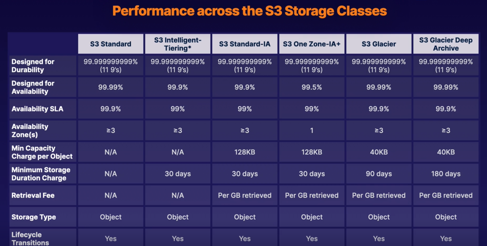

# Simple Service Storage (S3)

## What is S3

- Object Storage
  - Provides secure, durable, highly scalable object storage
- Scalable
  - S3 allows you to store and retrieve any amount of data from anywhere on the web at a very low cost
- Simple
  - Amazon S3 is easy to use with a simple web service interface

Manages data as objects rather than in file systems or data blocks

- Can store:
  - Any type of file
    - Photos, videos, code, documents, and text files
- Can NOT Store:
  - Operating System
  - Database

## S3 Basics

1. Unlimited Storage with S3
2. Objects can be 5TB in size
   1. 5GB max single put
3. Buckets are used to store files (similar to folders)

- Universal Namespaces so S3 bucket names must be globally unique
- Understanding the S3 URLS
  - Will always be https://BUCKET_NAME.s3.REGION.amazonaws.com/KEY_NAME
  - Example: https://acloudguru.s3.us-east-1.amazonaws.com/my_pic.jpg

## Key Values Stores

Keys:

The name of the objects (e.g., my_pic.jpg)

Value:

The data itself, which is made up of a sequence of bytes

Version ID:

Important for storing multiple versions of the same object

Metadata:

Data about the data you are storing (eg. content-type, last-modified, etc)

## Availability and Durability

S3 is built for availability with 99.95% - 99.99% service availability, depending on S3 tier

S3 is designed for durability with 99.999999999% (9 decimal places) durability for data stored in S3

## Types

### Standard S3 (Default Type)

Highly available and durable. Data is stored redundantly across multiple devices in multiple facilities (>= 3 AZs)

Designed for Frequent access!

Suitable for most workloads

### Standard-Infrequent Access

99.9% Availability

99.99999999999% Durability (11 9's)

Designed for infrequent accessed data

- Rapid Access
  - Used for data that is accessed less frequently but requires rapid access when needed
- Pay to Access to Data
  - This is a low per-GB storage price
  - Has a per-GB retrieval fee
- Use cases
  - Great for long-term storage, backups, and as a data store for disaster recovery files

### One Zone-Infrequent Access

99.5% Availability

99.99999999999% Durability (11 9's)

Same as Standard-Infrequent Access but only in 1 AZ

20% less than S3 Standard-IA

Great for long-lived, infrequently accessed, non-critical data

### Glacier

99.99% Availability

99.99999999999% Durability (11 9's)

Retrieval times that range from 1 minute to 12 hours. Historically should be data accessed a few times a year.

- Cheap Storage
- Optimized for data that is VERY infrequently access
- Primarily used for ARCHIVING
- Pay each time you access data

#### Glacier Deep Archive

99.99% Availability

99.99999999999% Durability (11 9's)

Archive data that is RARELY accessed data with a default retrieval time of 12 hours

### Intelligent-Tiering

99.99% Availability

99.99999999999% Durability (11 9's)

Automatically moves your data based on the amount of times you access data

Optimizes cost for monthly fee.

### Storage Costs

## Lifecycle Management

Defined rules to automatically transition objects to a cheaper storage tier or delete objects that are no longer required after a set period of time

## Versioning

With versioning all versions of an object are stored and can be retrieved, including deleted objects

## Securing Data

1. Server-Side Encryption
   1. Can set default encryption on a bucket to encrypt all new objects that are stored in a bucket
2. Access Control Lists (ACLs)
   1. Define which AWS accounts or groups are granted access and type of access. You can attach a S3 ACLs to individual objects within a bucket
3. Bucket Policies
   1. S3 bucket polices specify what actions are allowed or denied (allow a user Alice to PUT but not DELETE objects in the bucket)
   2. JSON policies

### ACL vs Bucket Policies

Access Control lists are designed to be applied to individual object levels

Bucket policies are designed to be applied to entire bucket

## Data consistency

Strong Read-After-Write consistency

- After a successful write of a new object (PUT) or overwrite of an existing object, any subsequent read request immediately recieves the latest version of the object
- Strong consistency for list operations, so after a write you can immediately perform a listing of objects in a bucket with all changes reflected.

## Hosting Static Website In S3

You can use S3 to host static websites.

S3 is great for hosting static websites since S3 Scales on demand!

Must provide all static files and give index.html location and can optionally provide (error.html)

Must apply policy to make objects public

## Versioning Objects in S3

### What is versioning

Allows us to have multiple versions in s3 bucket

Advantages:

- Keep all versions of objects in s3
- Once enabled cannot be disabled (only suspended)
- Supports MFA
- Lifecycle Rules
- Great for Backup Tools

Deletion creates a delete marker and does not actually delete the file. In order to restore a file the delete marker must be deleted.

## S3 Object Lock

You can use s3 object lock to store objects using a Write Once Read Many (WORM) model. It can help prevent objects from being deleted or modified for a fixed amount of time or indefinitely

You can use S3 object lock to meet regulatory requirements that require WORM storage, or add an extra layer of protection against objects changes and deletions

### Governance Mode

In governance mode users cant overwrite or delete an object version or alter its lock settings unless they have special permissions.

With governance mode you protect objects against being deleted by most users, but you still grant some users permission to alter the retention settings or delete the objects if necessary

### Compliance Mode (Hardcore)

In compliance mode, a protected object version cant be overwritten or deleted by any user INCLUDING the root user in your AWS account. When an object is locked in compliance mode, its retention mode cant be changed
and its retention period cant be shortened. Compliance mode ensures an object version cant be overwritten or deleted for the duration of the retention period.

#### Retention Periods

A retention period protects an object version for a fixed amount of time. When you place a retention period on an object version, Amazon S3 stores a timestamp in the object version's meta data to indicate when the retention period expires.

After retention period expires, the object version can be overwritten or deleted unless you also placed a legal hold on the object version.

#### Legal Holds

S3 object lock also enables you to place a legal hold on an object version. Like a retention period a legal hold prevents an object version from being overwritten or deleted. However a legal hold does not have an associated retention period and remains in effect until removed. Legal holds can be freely placed and removed by any user who has the s3:PutObjectLegalHold permission.

### Glacier Vault Lock

A way to apply a WORM model to the entire Glacier bucket

## S3 Encryption

- Encryption in Transit
  - SSL/TLS
  - HTTPS
- Encryption at Rest: Server Side Encryption
  - SSE-S3: S3-managed keys, using AES 256-bit encryption
  - SSE-KMS: AWS Key management service managed keys
  - SSE-C: Customer provided keys
- Encryption at Rest: Client Side Encryption
  - Encrypt files yourself before uploading files

### Enforcing Server-Side Encryption

#### Console Server-Side Encryption

Select the encryption setting on your S3 bucket. The easiest way is just to checkbox the console

#### Bucket Policy Server-Side Encryption

Can enforce encryption using bucket policy

To encrypt file at upload time use:

- x-amz-server-side-encryption
  - If the file is to be encrypted at upload time this parameter will need ot be included in the request header
  - Two Options:
    - AES256 (SSE-S3 - S3 managed keys)
    - aws:kms (SSE-KMS - KMS managed keys)
  - When parameter is included in the header of the PUT request, it tells S3 to encrypt the object at the time of upload using a specified encryption method.

So to enforce encryption with Bucket Policies deny any PUT requests that are missing the encryption parameter in the header.

## S3 Prefixes

After our bucket name we can have folders such as

`BUCKET_NAME/folder1/subfolder1`

`BUCKET_NAME/folder2/subfolder1`

`BUCKET_NAME/folder3`

Prefix is just the folder pwd and not the file key

## S3 Performance

S3 has extremely low latency. You can get the first byte out of S3 within 100-200 milliseconds

You can achieve a high number of requests: 3500 PUT/COPY/POST/DELETE and 5500 GET/HEAD requests per second, per prefix

Thus the more prefixes we have in our bucket the more performant it can become

## S3 Limitation When Using KMS

If you are using SSE-KMS to encrypt your objects in S3 you must keep in mind the KMS limit which are Region specific

- Based on Region requests per second ranges from 5500, 10000, 30000
- Uploading and downloading will count towards the KMS quota
- Currently you can NOT request a quota increase for KMS

### Uploads

Recommended for files over 100 MB and REQUIRED for files over 5 GB

Parallelize uploads (increases efficiency)

Breaks big file into smaller parts and combines them into S3

### Downloads

Byte range fetches

Parallelize downloads by specifying byte ranges

If failure in download its only for specific byte range

## Backup Data With S3 Replication

Used to be called "Cross Region Replication"

Allows us to replicate objects from one bucket to another

- Versioning must be turned on in both buckets
- Objects existing in bucket are NOT automatically replicated
  - Once replication is turned on all subsequent updated objects will be replicated automatically
- Delete markers are not replicated by default

## Exam tips

- S3 is a safe place to store your files
  - The data is spread across multiple devices and facilities to ensure availability and durability
- Object Based (allows you to upload any file type)
- NOT for OS or DB storage
- Max File Size is 5TB
- Min File size is 0 bytes
- Unlimited Storage!!
- Will always be https://BUCKET_NAME.s3.REGION.amazonaws.com/KEY_NAME
- Successful CLI or API uploads should always generate 200 return code
- Key: Object Name
- Value: Data itself
- Version ID: Allows you to store multiple versions of same object
- Versioning is not enabled by default because it costs money to store extra copies of data so the user must choose to opt in
- Metadata: Data about data you are storing (content-type, last-modified)
- Buckets are private by default
- Both bucket and object must be public to use!
- Uploading objects to bucket using CLI or API should always return 200 status code
- Can serve Static content websites
- S3 scales on demand
- Versioning supports MFA to require 2 forms of authorization to delete an object
- To enforce WORM model use S3 Object Locks
- Compliance mode stops any user from deleting or modifying objects (even ROOT user)
- Governance mode stops MOST users from deleting or modifying objects
- Encryption in transit with (SSL/TLS and HTTPS)
- Encryption at Rest: SSE (SSE-S3, SSE-KMS, SSE-C)
- Enforcement of encryption can be done with a bucket policy
- With replication Delete markers are not replicated by default